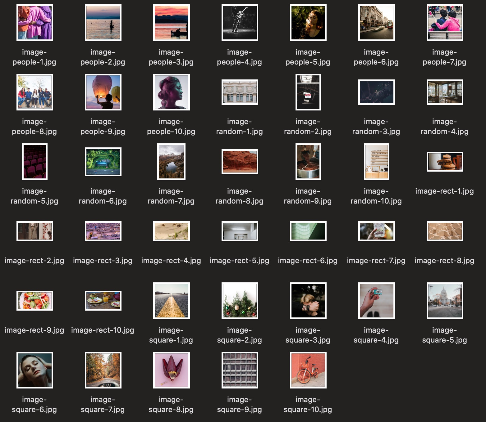

Download random images for work on web development or design.

- 10 random images with random sizes
- 10 people images with  200x200
- 10 square images with  800x800
- 10 rectangle images with  800x400



# Install

``` bash
curl -L https://raw.githubusercontent.com/tanrax/place-image/master/place-images -o place-images
chmod +x place-images
sudo mv place-images /usr/local/bin
```

# Use

Execute in the folder where you want to create the random images.
Attention! It will **delete any JPG** image that exists in the directory.

``` bash
place-images
```
